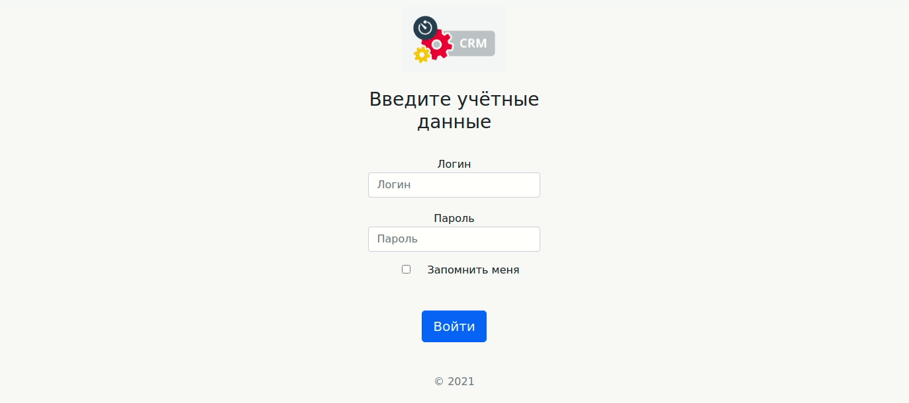

## Furniture store CRM

This is a prototype of a CRM for a big furniture store in Moscow. Our client allowed us to provide this prototype in public, so here we are!

It was deployed on Heroku: https://crmfurniture.herokuapp.com/users

Stack, we used: JS, Express, Bootstrap, PSQL, Sequelize.

Here's gif-demo, how it works:

Team:

<a href='https://github.com/olegTheCoder'>Fullstack, Oleg Grachov</a>

<a href='https://github.com/rogovenko'>Fullstack, Ilya Rogovenkо </a>

<a href='https://github.com/RoofDestroyer'>Fullstack, Nikita Guznov </a>

<a href='https://github.com/Valb0g'>Fullstack, Vladislav Bogachev </a>

